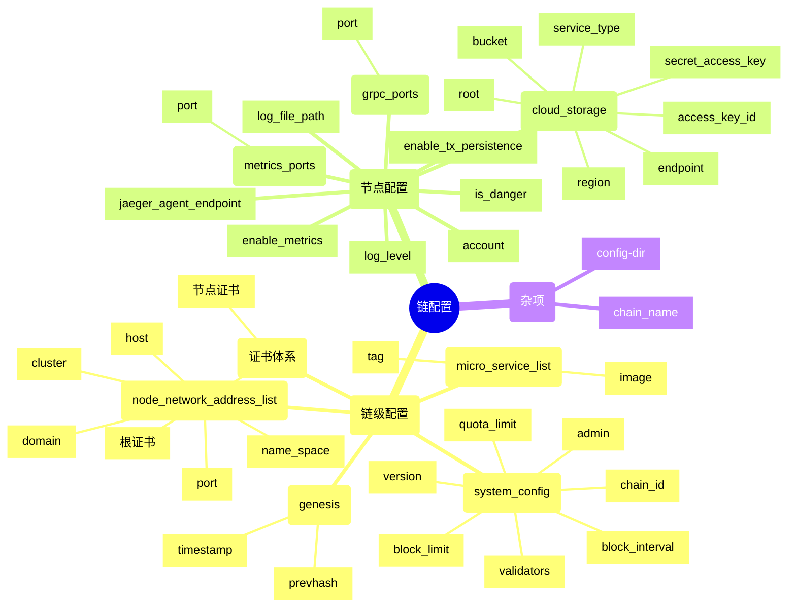

# cloud-config

创建链的配置文件和部署文件。

### 依赖

* rust: 1.59+

### 安装

```
cargo install --path .
```

### 用法

```
$ cloud-config -h
cloud-config 6.7.3
Rivtower Technologies <contact@rivtower.com>

Usage: cloud-config <COMMAND>

Commands:
  init-chain         init a chain
  init-chain-config  init chain config
  set-admin          set admin of chain
  set-validators     set validators of chain
  append-validator   append a validator into chain
  set-nodelist       set node list
  append-node        append a node into chain
  delete-node        delete a node from chain
  init-node          init node
  update-node        update node
  delete-chain       delete a chain
  new-account        new account
  import-account     import account
  create-ca          create CA
  create-csr         create csr
  sign-csr           sign csr
  create             create config in one cmd
  append             append node in one cmd
  delete             delete node in one cmd
  set-stage          set stage
  import-ca          import ca
  import-cert        import node cert
  update-yaml        update k8s yaml
  delete-validator   delete a validator from chain
  help               Print this message or the help of the given subcommand(s)

Options:
  -h, --help     Print help
  -V, --version  Print version
```

### 设计
先前工具的实现方式是，通过用户传递的命令行参数，直接生成一条链所有节点的微服务配置文件。

这种实现方式有两个问题：

1. 所有的逻辑混在一起。当需要针对不同的运行环境设置不同的配置逻辑时，会增加很多的分支判断，导致代码可维护性下降。比如，针对开发环境，需要在本地运行所有节点，因此需要各个节点的微服务端口不重复；而针对`k8s`生产环境，则要求各个节点的微服务端口保持一致。
2. 因为要同时传递一条链多个节点的信息，用户需要传递的参数非常多，心智负担比较大，非常容易出错。并且也不符合实际生产环境部署的时候，各个节点由不同参与方来提供信息的特点。

在新的实现中，抽象出[链级配置](/src/config/chain_config.rs)和[节点配置](/src/config/node_config.rs)两个数据结构。`链级配置`包含一条链内所有节点都需要的公共信息；`节点配置`包含链内一个具体节点所需的信息。两个数据结构结合，包含了创建一条链所需的所有信息。

用户通过命令行参数传递的信息来填充这两个数据结构，然后据此产生出各个节点的所有配置文件。这样就分离了前端信息填充和后端生成配置文件。后续不管是优化前端用户输入信息的体验，还是在以后版本中配置文件结构有变化，都会比较容易修改，保证代码可维护性比较高。

用户通过命令行参数填充`链级配置`和`节点配置`的过程也被拆分成了多个子命令。一方面可以减少单个子命令的参数个数，另一方面整个过程更加灵活。可以适用于测试时集中生成的中心化模式，也可以适用于实际生产部署时，不同子命令由不同参与方执行的去中心化模式。

#### 配置项与数据结构

当前版本的配置项如下图所示：



#### 流程

将创建链配置的过程拆分成10个子命令和7个辅助的子命令，以实现最正规的去中心化配置流程。

7个辅助子命令为：

1. [create-ca](/src/create_ca.rs)创建链的根证书。会在`$(config-dir)/$(chain-name)/ca_cert/`下生成`cert.pem`和`key.pem`两个文件。
2. [create-csr](/src/create_csr.rs)为各个节点创建证书和签名请求。会在`$(config-dir)/$(chain-name)/certs/$(domain)/`下生成`csr.pem`和`key.pem`两个文件。
3. [sign-csr](/src/sign_csr.rs)处理节点的签名请求。会在`$(config-dir)/$(chain-name)/certs/$(domain)/`下生成`cert.pem`。
4. [new-account](/src/new_account.rs)创建账户。会在`$(config-dir)/$(chain-name)/accounts/`下，创建以账户地址为名的文件夹，里面有`node_address`，`private_key`，和`validator_address`三个文件。
5. [import-account](/src/import_account.rs)导入私钥的方式创建账户。会在`$(config-dir)/$(chain-name)/accounts/`下，创建以账户地址为名的文件夹，里面有`node_address`，`private_key`，和`validator_address`三个文件。
6. [import-ca](/src/import_ca.rs)导入已有的`CA`证书。要求证书格式为`pem`，`key`的格式为`pkcs8`。
7. [import-cert](/src/import_cert.rs)导入已有的节点证书。要求证书格式为`pem`，`key`的格式为`pkcs8`。

10个子命令分别为：
1. [init-chain](/src/init_chain.rs)。根据指定的`config-dir`和`chan-name`,初始化一个链的文件目录结构。
    ```
    $(config_dir)
    --  $(chain_name)
    ------  accounts
    --------  .gitkeep
    ------  ca_cert
    --------  .gitkeep
    ------  certs
    --------  .gitkeep
    ------  .gitignore
    ```
2. [init-chain-config](/src/init_chain_config.rs)。初始化除`admin`(管理员账户)，`validators`(共识节点地址列表)，`node_network_address_list`（节点网络地址列表）之外的`链级配置`。因为前述三个操作需要一些额外的准备工作，且需要先对除此之外的链接配置信息在所有参与方之间达成共识。因此对于去中心化场景来说，这一步其实是一个公示的过程。执行之后会生成`$(config-dir)/$(chain-name)/chain_config.toml`
3. [set-admin](/src/set_admin.rs)。设置管理员账户。账户需要事先通过[new-account](/src/new_account.rs)子命令创建。默认网络微服务为`network_zenoh`，还需要通过[create-ca](/src/create_ca.rs)创建链的根证书。
4. [set-validators](/src/set_validators.rs)。设置共识节点账户列表。账户同样需要事先通过[new-account](/src/new_account.rs)子命令，由各个共识节点分别创建，然后将账户地址集中到一起进行设置。
5. [set-nodelist](/src/set_nodelist.rs)。设置节点网络地址列表。各个节点参与方需要根据自己的网络环境，预先保留节点的`ip`，`port`和`domain`。然后将相关信息集中到一起进行设置。至此，`链级配置`信息设置完成，可以下发配置文件`chain_config.toml`到各个节点。默认网络微服务为`network_zenoh`，则需要通过`create-csr`根据节点的`domain`为各个节点创建证书和签名请求。然后请求`CA`通过`sign-crs`处理签名请求，并下发生成的`cert.pem`到各个节点。
6. [set-stage](/src/set_stage.rs)设置链配置进行到的阶段。将链的配置过程分为三个阶段，分别为`init`，`public`和`finalize`，一些子命令会根据当前所处的阶段，来判断是否可以进行操作，以避免一些误操作。`init-chain-config`初始化链的配置时，默认设置阶段为`init`，该阶段可以重复进行`init-chain-config`以修改链的基础配置；`set-admin`只能在`init`阶段执行，并且会自动将阶段修改为`public`；`append-validator`，`delete-validator`和`set-validators`只能在`public`阶段进行；此后需要手工执行该命令将阶段修改为`finalize`，此时链的配置完成，不能再修改除`节点网络地址列表`之外的配置，并且此后才可以进行`init-node`操作。辅助命令和`delete-chain`不受阶段的限制。
7. [init-node](/src/init_node.rs)。设置`节点配置`信息。这步操作由各个节点的参与方独立设置，节点之间可以不同。执行之后会生成`$(config-dir)/$(chain-name)-$(domain)/node_config.toml`
8. [update-node](/src/update_node.rs)。根据之前设置的`链级配置`和`节点配置`，生成每个节点所需的微服务配置文件。
9. [update-yaml](/src/update_yaml.rs)。根据之前设置的`链级配置`和`节点配置`，生成每个节点部署到`k8s`环境所需的资源文件。
10. [delete-chain](/src/delete_chain.rs)删除链。删除属于该链的所有文件夹以及其中的文件，`使用时要慎重`。

此外还有一些其他操作的子命令。

比如增加单个共识节点的`append-validator`，删除单个共识节点的`delete-validator`；增加单个网络节点的`append-node`，删除单个网络节点的`delete-node`。

在前述流程的基础上，封装了更高级更方便使用的命令。

有`create`，`append`和`delete`，无需执行很多子命令，也无需传递大量参数就可以生成和操作一条链的配置。


### 使用示例

#### init-chain

参数：

```
        --chain-name <CHAIN_NAME>    set chain name [default: test-chain]
        --config-dir <CONFIG_DIR>    set config file directory, default means current directory
                                     [default: .]
```

```
$ cloud-config init-chain   
$ tree -a test-chain/
test-chain/
├── .gitignore
├── accounts
│   └── .gitkeep
├── ca_cert
│   └── .gitkeep
└── certs
    └── .gitkeep
```

#### init-chain-config

参数：

```
      --chain-name <CHAIN_NAME>
          set chain name [default: test-chain]
      --config-dir <CONFIG_DIR>
          set config file directory, default means current directory [default: .]
      --timestamp <TIMESTAMP>
          set genesis timestamp [default: 0]
      --prevhash <PREVHASH>
          set genesis prevhash [default: 0x0000000000000000000000000000000000000000000000000000000000000000]
      --version <VERSION>
          set system config version [default: 0]
      --chain_id <CHAIN_ID>
          set system config chain_id [default: ]
      --block_interval <BLOCK_INTERVAL>
          set system config block_interval [default: 3]
      --block_limit <BLOCK_LIMIT>
          set system config block_limit [default: 100]
      --quota-limit <QUOTA_LIMIT>
          set one block contains quota limit, default 1073741824 [default: 1073741824]
      --network_image <NETWORK_IMAGE>
          set network micro service image name (network_zenoh) [default: network_zenoh]
      --network_tag <NETWORK_TAG>
          set network micro service image tag [default: latest]
      --consensus_image <CONSENSUS_IMAGE>
          set consensus micro service image name (consensus_raft/consensus_overlord) [default: consensus_overlord]
      --consensus_tag <CONSENSUS_TAG>
          set consensus micro service image tag [default: latest]
      --executor_image <EXECUTOR_IMAGE>
          set executor micro service image name (executor_evm) [default: executor_evm]
      --executor_tag <EXECUTOR_TAG>
          set executor micro service image tag [default: latest]
      --storage_image <STORAGE_IMAGE>
          set storage micro service image name (storage_opendal) [default: storage_opendal]
      --storage_tag <STORAGE_TAG>
          set storage micro service image tag [default: latest]
      --controller_image <CONTROLLER_IMAGE>
          set controller micro service image name (controller_hsm) [default: controller_hsm]
      --controller_tag <CONTROLLER_TAG>
          set controller micro service image tag [default: latest]
```

说明：
1. 参数部分基本对应`链级配置`数据结构，具体含义参见设计部分的描述。


```
$ cloud-config init-chain-config

$ tree test-chain/
test-chain/
├── accounts
├── ca_cert
├── certs
└── chain_config.toml

$ cat test-chain/chain_config.toml
node_network_address_list = []
stage = "Init"

[[micro_service_list]]
image = "network_zenoh"
tag = "latest"

[[micro_service_list]]
image = "consensus_overlord"
tag = "latest"

[[micro_service_list]]
image = "executor_evm"
tag = "latest"

[[micro_service_list]]
image = "storage_opendal"
tag = "latest"

[[micro_service_list]]
image = "controller_hsm"
tag = "latest"

[genesis_block]
prevhash = "0x0000000000000000000000000000000000000000000000000000000000000000"
timestamp = 1709695109593

[system_config]
admin = ""
block_interval = 3
block_limit = 100
chain_id = "63586a3c0255f337c77a777ff54f0040b8c388da04f23ecee6bfd4953a6512b4"
quota_limit = 1073741824
validators = []
version = 0
```

说明：
1. `timestamp`默认参数为0。检测到为默认值时，自动替换为当前时间对应的时间戳。
2. `chain_id`默认为空字符串。检测到为默认值时，自动替换为`hex(sm3($(chain_name)))`。

#### new-account

参数：

```
        --chain-name <CHAIN_NAME>
            set chain name [default: test-chain]

        --config-dir <CONFIG_DIR>
            set config file directory, default means current directory [default: .]
```

```
$ cloud-config new-account   
node_address: 29b4da67ecb5591f1c5cfba6509142678d266e79 validator_address: a14bbda941cb707e1979ad96a01bf5b25c0916805cde2c4d418e8831ab57df186174c32d765aa6f0da4c686c258ff5d1

$ cloud-config new-account
node_address: 5bf591636c7efc27cd855c2282a1652bfa14a1bc validator_address: b2a2f83851454504f66d20846c48dc1f6fbe71d0b7ba89b5b9483ca7417be3bd86a75b64e7fa5b13d0ef8f80a4c14a69

$ tree test-chain 
test-chain/
├── .gitignore
├── accounts
│   ├── .gitkeep
│   ├── 29b4da67ecb5591f1c5cfba6509142678d266e79
│   │   ├── node_address
│   │   ├── private_key
│   │   └── validator_address
│   └── 5bf591636c7efc27cd855c2282a1652bfa14a1bc
│       ├── node_address
│       ├── private_key
│       └── validator_address
├── ca_cert
│   └── .gitkeep
├── certs
│   └── .gitkeep
└── chain_config.toml
```

说明：
1. 这里会创建两个地址，一个用于标识节点的`node_address`，一个用于共识`validator`的`validator_address`。
2. 默认情况下两个地址是不一样的。但是当共识微服务选择`consensus_raft`时两者是一样的，注意区分。


#### import-account

参数：

```
--chain-name <CHAIN_NAME>
    set chain name [default: test-chain]

--config-dir <CONFIG_DIR>
    set config file directory, default means current directory [default: .]

--privkey <PRIVKEY>
    hex encoded private key
```

```
$ cloud-config import-account --privkey 60e7b47ee260516dbfedf8e80ff38830bae8663cc498a900a610c147cae94344
node_address: 097913007f2c8d9ac87f89664fc70977fee6bf9a validator_address: 965e7f200043a8ae543478330faf1c751f4c4d8040f93a7d0b8881085b8583bea6f7166ddc0c5bb9adff8563f7b3cbd2

$ tree test-chain/
test-chain/
├── accounts
│   └── 097913007f2c8d9ac87f89664fc70977fee6bf9a
│       ├── node_address
│       ├── private_key
│       └── validator_address
├── ca_cert
├── certs
└── chain_config.toml
```

说明：

1. 这里会创建两个地址，一个用于标识节点的`node_address`，一个用于共识`validator`的`validator_address`。
2. 默认情况下两个地址是不一样的。但是当共识微服务选择`consensus_raft`时两者是一样的，注意区分。

#### set-admin

参数：

```
        --admin <ADMIN>              set admin
        --chain-name <CHAIN_NAME>    set chain name [default: test-chain]
        --config-dir <CONFIG_DIR>    set config file directory, default means current directory
                                     [default: .]
```

说明：

1. `admin`为必选参数。值为之前用`new-account`创建的`node_address`地址。


```
$ cloud-config set-admin --admin aeaa6e333b8ed911f89acd01e88e3d9892da87b5

$ cat test-chain/chain_config.toml | grep admin
admin = 'aeaa6e333b8ed911f89acd01e88e3d9892da87b5'
```

#### set-validators

参数：

```
        --chain-name <CHAIN_NAME>    set chain name [default: test-chain]
        --config-dir <CONFIG_DIR>    set config file directory, default means current directory
                                     [default: .]
        --validators <VALIDATORS>    validators account splited by ','
```

说明：

1. `validators`为必选参数。值为多个之前用`new-account`创建的`validator_address`地址,用逗号分隔。

```
$ cloud-config set-validators --validators a14bbda941cb707e1979ad96a01bf5b25c0916805cde2c4d418e8831ab57df186174c32d765aa6f0da4c686c258ff5d1,b2a2f83851454504f66d20846c48dc1f6fbe71d0b7ba89b5b9483ca7417be3bd86a75b64e7fa5b13d0ef8f80a4c14a69

$ cat test-chain/chain_config.toml | grep -A3 validators
validators = [
    "a14bbda941cb707e1979ad96a01bf5b25c0916805cde2c4d418e8831ab57df186174c32d765aa6f0da4c686c258ff5d1",
    "b2a2f83851454504f66d20846c48dc1f6fbe71d0b7ba89b5b9483ca7417be3bd86a75b64e7fa5b13d0ef8f80a4c14a69",
]
```

#### append-validator

参数：

```
        --chain-name <CHAIN_NAME>    set chain name [default: test-chain]
        --config-dir <CONFIG_DIR>    set config file directory, default means current directory
                                     [default: .]
        --validator <VALIDATOR>      validator account
```

说明：

1. `validator`为必选参数。值为之前用`new-account`创建的`validator_address`地址。
2. 功能与`set-validators`相似，只不过是每次添加一个地址。

#### delete-validator

参数：

```
        --chain-name <CHAIN_NAME>    set chain name [default: test-chain]
        --config-dir <CONFIG_DIR>    set config file directory, default means current directory
                                     [default: .]
        --validator <VALIDATOR>      validator account
```

说明：

1. `validator`为必选参数。要删除的共识账户地址。
2. 功能与`append-validator`相反，删除一个共识账户。

#### set-stage

参数：

```
        --chain-name <CHAIN_NAME>    set chain name [default: test-chain]
        --config-dir <CONFIG_DIR>    set config file directory, default means current directory
                                     [default: .]
        --stage <STAGE>              set stage init/public/finalize [default: finalize]
```

说明：

1. `stage`为要设置的阶段名称。默认值为`finalize`，因为其他两个阶段会随着子命令自动变迁，正常情况下只有`finalize`需要手工设置。各阶段的详细含义参见设计部分的描述。
2. 只有确定过了某个阶段才发现前一个阶段的信息还需要修改，才需要回溯阶段。随意回溯阶段，可能会导致配置被不合理的修改，请谨慎操作。

```
$ cat test-chain/chain_config.toml | grep stage
stage = 'Public'
$ cloud-config set-stage
$ cat test-chain/chain_config.toml | grep stage
stage = 'Finalize'
```

#### set-nodelist

参数：

```
      --chain-name <CHAIN_NAME>  set chain name [default: test-chain]
      --config-dir <CONFIG_DIR>  set config file directory, default means current directory [default: .]
      --nodelist <NODE_LIST>     node list looks like localhost:40000:node0:k8s_cluster_name_1:namespace_1,localhost:40001:node1:k8s_cluster_name_2:namespace_2 for each node network address: k8s_cluster_name is optional, none means not k8s env. namespace is optional, none means default namespace
```

说明：

1. `nodelist`为必选参数。值为多个节点的网络地址,用逗号分隔。每个节点的网络地址包含`host`,`port`，`domain`，`cluster name`，`namespace`，之间用冒号分隔。
2. `cluster name`是节点所在的`k8s`集群的标识。如果节点部署在非`k8s`环境则该项省略。
3. `namespace`是节点在`k8s`集群中部署的命名空间。该项为可选项，默认为`default`命令空间，如果部署在非`default`命令空间，请填写真实的命令空间。
4. `domain`为任意字符串，只需要确保节点之间不重复即可。

```
$ cloud-config set-nodelist --nodelist 8.8.8.8:40000:node0:k8s,8.8.8.8:40001:node1:k8s,8.8.8.8:40002:node2:k8s:cita,rivtower.com:40003:node3,9.9.9.9:40004:node4

$ cat test-chain/chain_config.toml | grep -A5 node_network
[[node_network_address_list]]
cluster = "k8s"
domain = "node0"
host = "8.8.8.8"
name_space = "default"
port = 40000
--
[[node_network_address_list]]
cluster = "k8s"
domain = "node1"
host = "8.8.8.8"
name_space = "default"
port = 40001
--
[[node_network_address_list]]
cluster = "k8s"
domain = "node2"
host = "8.8.8.8"
name_space = "cita"
port = 40002
--
[[node_network_address_list]]
cluster = ""
domain = "node3"
host = "rivtower.com"
name_space = "default"
port = 40003
--
[[node_network_address_list]]
cluster = ""
domain = "node4"
host = "9.9.9.9"
name_space = "default"
port = 40004
```

该示例设置了5个节点：

1. 其中node0和node1位于同一个`k8s`集群的同一个命名空间(默认default)中
2. node2和前两个节点位于同一个`k8s`集群，但是不同的命名空间（cita）中
3. node3没有部署在`k8s`集群中，使用域名加端口的方式连接
4. node4也没有部署在`k8s`集群中，使用`ip`加端口的方式连接

#### append-node

参数：

```
      --chain-name <CHAIN_NAME>  set chain name [default: test-chain]
      --config-dir <CONFIG_DIR>  set config file directory, default means current directory [default: .]
      --node <NODE>              node network address looks like localhost:40002:node2:k8s_cluster_name:namespace k8s_cluster_name is optional, none means not k8s env. namespace is optional, none means default namespace
```

1. `node`为必选参数。值为节点的网络地址,包含`host`,`port`，`domain`，`cluster name`，`namespace`，之间用冒号分隔。
2. `cluster name`是节点所在的`k8s`集群的标识。如果节点部署在非`k8s`环境则该项省略。
3. `namespace`是节点在`k8s`集群中部署的命名空间。该项为可选项，默认为`default`命令空间，如果部署在非`default`命令空间，请填写真实的命令空间。
4. 功能与`set-nodelist`相似，只不过是每次添加一个节点。

#### delete-node

参数：

```
        --chain-name <CHAIN_NAME>    set chain name [default: test-chain]
        --config-dir <CONFIG_DIR>    set config file directory, default means current directory
                                     [default: .]
        --domain <DOMAIN>            domain of node that want to delete
```

1. `domain`为必选参数。作为节点的标识，标识要删除的节点。
2. 功能与`append-node`相反，删除一个节点。

#### create-ca

参数：

```
        --chain-name <CHAIN_NAME>    set chain name [default: test-chain]
        --config-dir <CONFIG_DIR>    set config file directory, default means current directory
                                     [default: .]
```

```
$ cloud-config create-ca

$ tree test-chain
test-chain
├── accounts
├── ca_cert
│   ├── cert.pem
│   └── key.pem
├── certs
└── chain_config.toml
```

说明：
1. 该命令生成文件形式的根证书，存放在`ca_cert`目录下。

#### create-csr

参数：

```
        --chain-name <CHAIN_NAME>    set chain name [default: test-chain]
        --config-dir <CONFIG_DIR>    set config file directory, default means current directory
                                     [default: .]
        --domain <DOMAIN>            domain of node
```

说明：
1. `domain`为必选参数。值为前面`set-nodelist`或者`append-node`时传递的节点的网络地址中的`domain`。
2. 证书中真正使用的`domain`是`$(chain-name)-$(domain)`。

```
$ cloud-config create-csr --domain node0

$ cloud-config create-csr --domain node1

$ tree test-chain
test-chain
├── accounts
├── ca_cert
│   ├── cert.pem
│   └── key.pem
├── certs
│   ├── node0
│   │   ├── csr.pem
│   │   └── key.pem
│   └── node1
│       ├── csr.pem
│       └── key.pem
└── chain_config.toml
```

说明：
1. 该命令生成节点的私钥和签名请求，存放在`certs`目录下。
2. 每个节点的文件都在以节点`domain`为文件名的子文件夹内。

#### sign-csr

参数：

```
        --chain-name <CHAIN_NAME>    set chain name [default: test-chain]
        --config-dir <CONFIG_DIR>    set config file directory, default means current directory
                                     [default: .]
        --domain <DOMAIN>            domain of node
```

说明：
1. `domain`为必选参数。值为前面执行`create-csr`时节点的`domain`。

```
$ cloud-config sign-csr --domain node0

$ cloud-config sign-csr --domain node1

$ tree test-chain
test-chain
├── accounts
├── ca_cert
│   ├── cert.pem
│   └── key.pem
└── certs
│    ├── node0
│    │   ├── cert.pem
│    │   ├── csr.pem
│    │   └── key.pem
│    └── node1
│        ├── cert.pem
│        ├── csr.pem
│        └── key.pem
└── chain_config.toml
```

说明：
1. 该命令生成节点的证书文件`cert.pem`，存放在`certs`目录下。
2. 每个节点的文件都在以节点`domain`为文件名的子文件夹内。

#### import-ca

参数：

```
        --ca-cert <CA_CERT_PATH>     set path of ca cert file(pem)
        --ca-key <CA_KEY_PATH>       set path of ca key file(pem)
        --chain-name <CHAIN_NAME>    set chain name [default: test-chain]
        --config-dir <CONFIG_DIR>    set config file directory, default means current directory
                                     [default: .]
```

说明：
1. `ca-cert`为必选参数。为要导入的`CA`证书文件路径，格式为`pem`。
2. `ca-key`为必选参数。为要导入的`CA`证书`key`文件路径，格式为`pem`，并且编码格式为`pkcs8`。

#### import-cert

参数：

```
        --cert <CERT_PATH>           set path of cert file(pem)
        --chain-name <CHAIN_NAME>    set chain name [default: test-chain]
        --config-dir <CONFIG_DIR>    set config file directory, default means current directory
                                     [default: .]
        --domain <DOMAIN>            domain of node
        --key <KEY_PATH>             set path of key file(pem)
```

说明：
1. `domain`为必选参数。值为前面`set-nodelist`或者`append-node`时传递的节点的网络地址中的`domain`。
2. `cert`为必选参数。为要导入的节点证书文件路径，格式为`pem`。
4. `key`为必选参数。为要导入的节点证书`key`文件路径，格式为`pem`，并且编码格式为`pkcs8`。

#### init-node

参数：

```
      --chain-name <CHAIN_NAME>
          set chain name [default: test-chain]
      --config-dir <CONFIG_DIR>
          set config file directory, default means current directory [default: .]
      --domain <DOMAIN>                                                                                                                                                                                    
          domain of node                                                                             
      --network-port <NETWORK_PORT>               
          grpc network_port of node [default: 50000]                                                 
      --consensus-port <CONSENSUS_PORT>           
          grpc consensus_port of node [default: 50001]                                               
      --executor-port <EXECUTOR_PORT>             
          grpc executor_port of node [default: 50002]                                                
      --storage-port <STORAGE_PORT>               
          grpc storage_port of node [default: 50003]                                                 
      --controller-port <CONTROLLER_PORT>                                                            
          grpc controller_port of node [default: 50004]                                              
      --log-level <LOG_LEVEL>                     
          log level [default: info]               
      --log-file-path <LOG_FILE_PATH>             
          log file path                           
      --jaeger-agent-endpoint <JAEGER_AGENT_ENDPOINT>                                                
          jaeger agent endpoint                   
      --account <ACCOUNT>                         
          account of node                         
      --network-metrics-port <NETWORK_METRICS_PORT>                                                  
          network metrics port of node [default: 60000]                                              
      --consensus-metrics-port <CONSENSUS_METRICS_PORT>                                              
          consensus metrics port of node [default: 60001]                                            
      --executor-metrics-port <EXECUTOR_METRICS_PORT>                                                
          executor metrics port of node [default: 60002]                                             
      --storage-metrics-port <STORAGE_METRICS_PORT>                                                  
          storage metrics port of node [default: 60003]                                              
      --controller-metrics-port <CONTROLLER_METRICS_PORT>                                            
          controller metrics port of node [default: 60004]                                           
      --disable-metrics                           
          disable metrics                         
      --is-danger                                 
          is chain in danger mode                 
      --enable-tx-persistence                     
          enable tx persistence                   
      --access-key-id <ACCESS_KEY_ID>             
          cloud_storage.access_key_id [default: ]                                                    
      --secret-access-key <SECRET_ACCESS_KEY>                                                        
          cloud_storage.secret_access_key [default: ]                                                
      --s3-endpoint <S3_ENDPOINT>                 
          cloud_storage.endpoint [default: ]                                                         
      --s3-bucket <S3_BUCKET>                     
          cloud_storage.bucket [default: ]                                                           
      --service-type <SERVICE_TYPE>               
          cloud_storage.service_type: s3/oss(aliyun)/obs(huawei)/cos(tencent)/azblob(azure) [default: ]                                                                                                    
      --s3-root <S3_ROOT>                         
          cloud_storage.root [default: ]                                                             
      --s3-region <S3_REGION>                     
          cloud_storage.region [default: ]                                                           
```

说明：
1. 参数部分基本对应`节点配置`数据结构，具体含义参见设计部分的描述。
2. `domain`为必选参数，作为节点的标识，节点文件夹将会以`$(chanin-name)-$(domain)`的形式命名。
3. `account`为必选参数，表示该节点要使用的账户地址。值为之前用`new-account`创建的`node_address`地址。

```
$ cloud-config init-node --domain node0 --account 5bf591636c7efc27cd855c2282a1652bfa14a1bc
 
$ cloud-config init-node --domain node1 --account 29b4da67ecb5591f1c5cfba6509142678d266e79

$ tree test-chain-node* 
test-chain-node0
├── accounts
├── ca_cert
├── certs
├── chain_config.toml
└── node_config.toml
test-chain-node1
├── accounts
├── ca_cert
├── certs
├── chain_config.toml
└── node_config.toml


$ cat test-chain-node0/node_config.toml
account = "5bf591636c7efc27cd855c2282a1652bfa14a1bc"
enable_metrics = true
is_danger = false
enable_tx_persistence = false
is_danger = false
log_level = "info"

[cloud_storage]
access_key_id = ""
bucket = ""
endpoint = ""
region = ""
root = ""
secret_access_key = ""
service_type = ""

[grpc_ports]
consensus_port = 50001
controller_port = 50004
executor_port = 50002
network_port = 50000
storage_port = 50003

[metrics_ports]
consensus_metrics_port = 60001
controller_metrics_port = 60004
executor_metrics_port = 60002
network_metrics_port = 60000
storage_metrics_port = 60003
```

#### update-node

参数：

```
        --chain-name <CHAIN_NAME>      set chain name [default: test-chain]
        --config-dir <CONFIG_DIR>      set config file directory, default means current directory
                                       [default: .]
        --config-name <CONFIG_NAME>    set config file name [default: config.toml]
        --domain <DOMAIN>              domain of node
```

说明：
1. `domain`为必选参数，作为节点的标识，表示要操作的节点。

```
$ cloud-config update-node --domain node0

$ cloud-config update-node --domain node1

$ tree test-chain-node*
test-chain-node0
├── chain_config.toml
├── config.toml
├── node_address
├── node_config.toml
├── private_key
└── validator_address
test-chain-node1
├── chain_config.toml
├── config.toml
├── node_address
├── node_config.toml
├── private_key
└── validator_address
```

#### update-yaml

参数：

```
      --chain-name <CHAIN_NAME>
          set chain name [default: test-chain]
      --config-dir <CONFIG_DIR>
          set config file directory, default means current directory [default: .]
      --config-name <CONFIG_NAME>
          set config file name [default: config.toml]
      --domain <DOMAIN>
          domain of node
      --pull-policy <PULL_POLICY>
          image pull policy: IfNotPresent or Always [default: IfNotPresent]
      --docker-registry <DOCKER_REGISTRY>
          docker registry [default: docker.io]
      --docker-repo <DOCKER_REPO>
          docker repo [default: citacloud]
      --storage-class <STORAGE_CLASS>
          storage class
      --access-mode <ACCESS_MODE>
          pvc access mode: ReadWriteOnce/ReadWriteMany [default: ReadWriteMany]
      --storage-capacity <STORAGE_CAPACITY>
          storage capacity [default: 10Gi]
      --requests-cpu <REQUESTS_CPU>
          container resource requirements -- requests cpu [default: 10m]
      --requests-memory <REQUESTS_MEMORY>
          container resource requirements -- requests memory [default: 32Mi]
      --limits-cpu <LIMITS_CPU>
          container resource requirements -- limits cpu [default: 4000m]
      --limits-memory <LIMITS_MEMORY>
          container resource requirements -- limits memory [default: 8192Mi]
      --enable-debug
          is enable debug
      --disable-health-check
          is disable health-check
      --enable-kustomize
          is gen kustomization
```

说明：

1. `domain`为必选参数，作为节点的标识，表示要操作的节点。
2. `storage-class`为必选参数，指定节点在`k8s`集群中的持久化存储使用的存储类。
3. `limits-cpu`,`limits-memory`,`requests-cpu`,`requests-memory`用于设定微服务的硬件资源需求。请根据实际运行环境的硬件配置进行调整，以获得最佳性能体验。
4. `enable-kustomize`开启之后会在节点目录下生成`kustomization`相关的文件，方便修改基础环境相关的配置而不用重新生成节点配置文件。保留原来的用法(`kubectl apply -f test-chain-node0/yamls`)不变，增加新的用法(`kubectl apply -k test-chain-node0`)。

```
$ cloud-config update-yaml --domain node0 --storage-class nfs-client
$ ls test-chain-node0/yamls
cm-account.yaml  cm-config.yaml  node-svc.yaml  node2-external-svc.yaml  node3-external-svc.yaml  node4-external-endpointslice.yaml  node4-external-svc.yaml  statefulset.yaml

$ cat test-chain-node0/yamls/node2-external-svc.yaml 
apiVersion: v1
kind: Service
metadata:
  name: test-chain-node2
spec:
  externalName: test-chain-node2.cita.svc.cluster.local
  type: ExternalName

$ cat test-chain-node0/yamls/node3-external-svc.yaml 
apiVersion: v1
kind: Service
metadata:
  name: test-chain-node3
spec:
  externalName: rivtower.com
  type: ExternalName

$ cat test-chain-node0/yamls/node4-external-svc.yaml 
apiVersion: v1
kind: Service
metadata:
  name: test-chain-node4
spec:
  ports:
  - name: network
    port: 40000
    protocol: UDP
    targetPort: 40004
$ cat test-chain-node0/yamls/node4-external-endpointslice.yaml 
apiVersion: discovery.k8s.io/v1
kind: EndpointSlice
addressType: IPv4
endpoints:
- addresses:
  - 9.9.9.9
metadata:
  labels:
    kubernetes.io/service-name: test-chain-node4
  name: test-chain-node4-1
ports:
- port: 40004
  protocol: UDP
```

说明：

1. `cm-account.yaml`,`cm-config.yaml`,`node-svc.yaml`,`statefulset.yaml`四个文件为节点基础的资源文件。
2. 针对同一个`k8s`集群，不同命名空间下的节点（比如这里的node2），会为其生成`external`类型的`Service`。
3. 对于外部节点，如果是域名方式访问（比如这里的node3），会为其生成`external`类型的`Service`，但是不支持端口映射。
4. 对于外部节点，如果是`ip`方式访问（比如这里的node4），会为其生成`external`类型的`Service`和对应的`EndpointSlice`，支持端口映射。

#### delete-chain

参数：

```
        --chain-name <CHAIN_NAME>    set chain name [default: test-chain]
        --config-dir <CONFIG_DIR>    set config file directory, default means current directory
                                     [default: .]
```

说明：
1. 该命令会删除所有跟指定链相关的文件夹及文件，`使用时要慎重`。


### 高级命令

说明：
1. 封装了`create`，`append`，`delete`三个高级命令。
2. `create`包含了`updata-yaml`之外所有的步骤，除`admin`账户需要用户创建并设置，节点的账号和证书均自动创建并设置。
2. `append`包含了新增节点`updata-yaml`之外所有的步骤，还会自动更新原有节点的配置。
3. `delete`删除指定的节点，还会自动更新剩余节点的配置。

#### create

参数：

```
      --chain-name <CHAIN_NAME>
          set chain name [default: test-chain]
      --config-dir <CONFIG_DIR>
          set config file directory, default means current directory [default: .]
      --timestamp <TIMESTAMP>
          set genesis timestamp [default: 0]
      --prevhash <PREVHASH>
          set genesis prevhash [default: 0x0000000000000000000000000000000000000000000000000000000000000000]
      --version <VERSION>
          set system config version [default: 0]
      --chain_id <CHAIN_ID>
          set system config chain_id [default: ]
      --block_interval <BLOCK_INTERVAL>
          set system config block_interval [default: 3]
      --block_limit <BLOCK_LIMIT>
          set system config block_limit [default: 100]
      --quota-limit <QUOTA_LIMIT>
          set one block contains quota limit, default 1073741824 [default: 1073741824]
      --network_image <NETWORK_IMAGE>             
          set network micro service image name (network_zenoh) [default: network_zenoh]                                                                                                                    
      --network_tag <NETWORK_TAG>                                                                    
          set network micro service image tag [default: latest]                                      
      --consensus_image <CONSENSUS_IMAGE>                                                            
          set consensus micro service image name (consensus_raft/consensus_overlord) [default: consensus_overlord]                                                                                         
      --consensus_tag <CONSENSUS_TAG>             
          set consensus micro service image tag [default: latest]                                    
      --executor_image <EXECUTOR_IMAGE>           
          set executor micro service image name (executor_evm) [default: executor_evm]                                                                                                                     
      --executor_tag <EXECUTOR_TAG>               
          set executor micro service image tag [default: latest]                                     
      --storage_image <STORAGE_IMAGE>             
          set storage micro service image name (storage_opendal) [default: storage_opendal]                                                                                                                
      --storage_tag <STORAGE_TAG>                 
          set storage micro service image tag [default: latest]                                      
      --controller_image <CONTROLLER_IMAGE>                                                          
          set controller micro service image name (controller_hsm) [default: controller_hsm]                                                                                                                   
      --controller_tag <CONTROLLER_TAG>           
          set controller micro service image tag [default: latest]                                   
      --admin <ADMIN>                             
          set admin                               
      --nodelist <NODE_LIST>                      
          node list looks like localhost:40000:node0:k8s_cluster_name_1:namespace_1,localhost:40001:node1:k8s_cluster_name_2:namespace_2 for each node network address: k8s_cluster_name is optional, none 
means not k8s env. namespace is optional, none means default namespace                               
      --log-level <LOG_LEVEL>                     
          log level [default: info]               
      --log-file-path <LOG_FILE_PATH>             
          log file path                           
      --jaeger-agent-endpoint <JAEGER_AGENT_ENDPOINT>                                                
          jaeger agent endpoint                   
      --is-danger                                 
          is chain in danger mode                 
      --enable-tx-persistence                     
          enable tx persistence                   
      --disable-metrics                           
          disable metrics                         
      --access-key-id <ACCESS_KEY_ID>             
          cloud_storage.access_key_id [default: ]                                                    
      --secret-access-key <SECRET_ACCESS_KEY>                                                        
          cloud_storage.secret_access_key [default: ]                                                
      --s3-endpoint <S3_ENDPOINT>                 
          cloud_storage.endpoint [default: ]                                                         
      --s3-bucket <S3_BUCKET>                     
          cloud_storage.bucket [default: ]                                                           
      --service-type <SERVICE_TYPE>               
          cloud_storage.service_type: s3/oss(aliyun)/obs(huawei)/cos(tencent)/azblob(azure) [default: ]                                                                                                    
      --s3-root <S3_ROOT>                         
          cloud_storage.root [default: ]                                                             
      --s3-region <S3_REGION>                     
          cloud_storage.region [default: ]
```

说明:
1. `admin`为必选参数。使用用户事先创建好的超级管理员账户地址。
2. `nodelist`为必选参数。值为多个节点的网络地址,用逗号分隔。每个节点的网络地址包含`host`,`port`，`domain`，`cluster name`，`namespace`，之间用冒号分隔。
2. `cluster name`是节点所在的`k8s`集群的标识。如果节点部署在非`k8s`环境则该项省略。
3. `namespace`是节点在`k8s`集群中部署的命名空间。该项为可选项，默认为`default`命令空间，如果部署在非`default`命令空间，请填写真实的命令空间。

```
$ cloud-config create --admin 0xff8456931c10a9b02ec4a657ee05e724ecad9372 --nodelist 8.8.8.8:40000:node0:k8s,8.8.8.8:40001:node1:k8s,8.8.8.8:40002:node2:k8s:cita,rivtower.com:40003:node3,9.9.9.9:40004:node4
node_address: c98975e0d4600af066c7c272a8573fef2347078c validator_address: 935bf75ab552629c201c67a9de01603ece5eaae970dd1fa39a65c13b31ba94d55c1f3ed3897dd7ce777e5850c4cded8e
node_address: d341294627c9f197f891cb4d88550a8bc3134b40 validator_address: a7f2102b16a6f4d5f3066ed54267b49408dc6e6e675bfd74c9c32900d11b0c453e19a1d6e1867cbd07de9dabb041de39
node_address: fea61c7a3c4dd9926d5f66317cf364cca91578c6 validator_address: 8e071ac04ab08aea0f1c4f5a7b0240337d36ec41caff5dd8b7169d17e4355cc44432a61e09607e95b356187a13570d4f
node_address: 700ad3bc022e230d77c29896ef6eaddee1e98816 validator_address: 8a47a817dd1f7a8bc52a78324ea1e83e804309dbffb49aca24149c5e88f2b53d7ffe34ada0a3792cb9b8095842ce5af9
node_address: 8aee0414c5a4b3943b288d8fca1505f180a76363 validator_address: 94996cb20c48cc759878d3699470bf77d3bd17da8ea8fdc7901860d7cef8c5e6b2fe713e1584c89974154a2189a701c8

$ ls test-chain-node0
accounts  ca_cert  certs  chain_config.toml  config.toml  node_address  node_config.toml  private_key  validator_address
```

#### append

参数：
```
      --chain-name <CHAIN_NAME>
          set chain name [default: test-chain]
      --config-dir <CONFIG_DIR>
          set config file directory, default means current directory [default: .]
      --log-level <LOG_LEVEL>
          log level [default: info]
      --log-file-path <LOG_FILE_PATH>
          log file path
      --jaeger-agent-endpoint <JAEGER_AGENT_ENDPOINT>
          jaeger agent endpoint
      --node <NODE>
          node network address looks like localhost:40002:node2:k8s_cluster_name:namespace k8s_cluster_name is optional, none means not k8s env. namespace is optional, none means default namespace
      --is-danger
          is chain in danger mode
      --enable-tx-persistence
          enable tx persistence
      --disable-metrics
          disable metrics
      --access-key-id <ACCESS_KEY_ID>
          cloud_storage.access_key_id [default: ]
      --secret-access-key <SECRET_ACCESS_KEY>
          cloud_storage.secret_access_key [default: ]
      --s3-endpoint <S3_ENDPOINT>
          cloud_storage.endpoint [default: ]
      --s3-bucket <S3_BUCKET>
          cloud_storage.bucket [default: ]
      --service-type <SERVICE_TYPE>
          cloud_storage.service_type: s3/oss(aliyun)/obs(huawei)/cos(tencent)/azblob(azure) [default: ]
      --s3-root <S3_ROOT>
          cloud_storage.root [default: ]
      --s3-region <S3_REGION>
          cloud_storage.region [default: ]
```

说明：
1. `node`为必选参数。值为节点的网络地址,包含`host`,`port`，`domain`，`cluster name`，`namespace`，之间用，冒号分隔。
2. `cluster name`是节点所在的`k8s`集群的标识。如果节点部署在非`k8s`环境则该项省略。
3. `namespace`是节点在`k8s`集群中部署的命名空间。该项为可选项，默认为`default`命令空间，如果部署在非`default`命令空间，请填写真实的命令空间。


```
$ cloud-config append --node 7.7.7.7:40005:node5:other_k8s
node_address: 1f759003513564058bd5ea7a4755761e60072169 validator_address: a367cd540d16b8b75bafd2fd16ef97e333f82b427e6f7e3ceb53a425a27c91fb1995b5ed8c42ea0561e8d571aaa4ee83
$ ls test-chain-node5
accounts  ca_cert  certs  chain_config.toml  config.toml  node_address  node_config.toml  private_key  validator_address
```

#### delete

参数：
```
        --chain-name <CHAIN_NAME>    set chain name [default: test-chain]
        --config-dir <CONFIG_DIR>    set config file directory, default means current directory
                                     [default: .]
        --domain <DOMAIN>            domain of node that want to delete
```

说明：
1. `domain`为必选参数。值为要删除节点的标识，与创建链和增加节点时的`domain`保持一致。

```
$ cloud-config delete --domain node5
$ ls
test-chain  test-chain-node0  test-chain-node1  test-chain-node2  test-chain-node3  test-chain-node4
```
